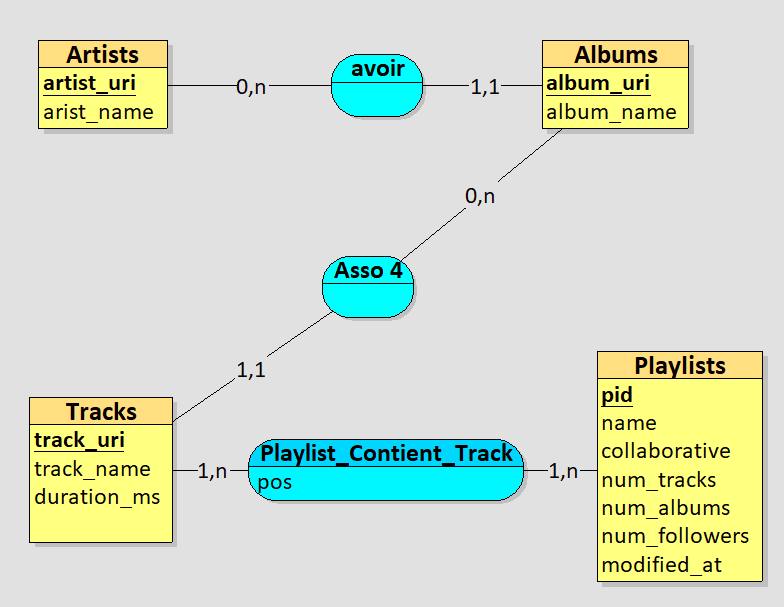
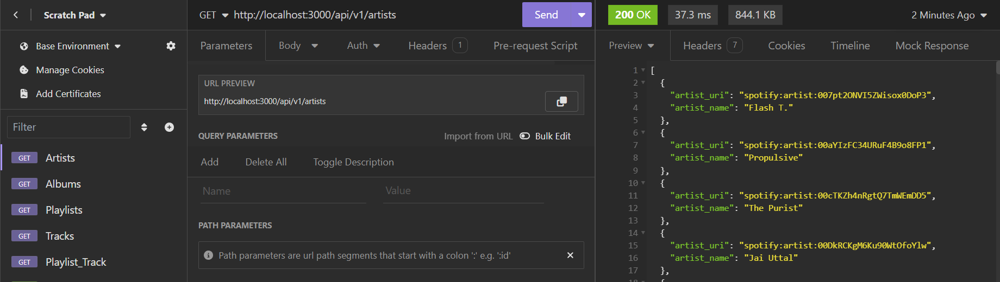

# Schema Relationnelle


# Installation des dépendences Nécessaire 

```sh
    npm init -y
```

```sh
    npm install express mysql2
```

# Configuration de la base de données

- Créez un fichier `db.config.js` dans le dossier `config`.

- Copiez et collez le contenu suivant dans `db.config.js` :

```javascript
// config/db.config.js
module.exports = {
    host: 'localhost',
    user: 'root',
    password: 'Votre Mot De passe de votre base de donnée',
    database: 'Spotify'
};
```
# Lancement du serveur

```sh
node index.js
```
# Test d'API sur Insomnia

